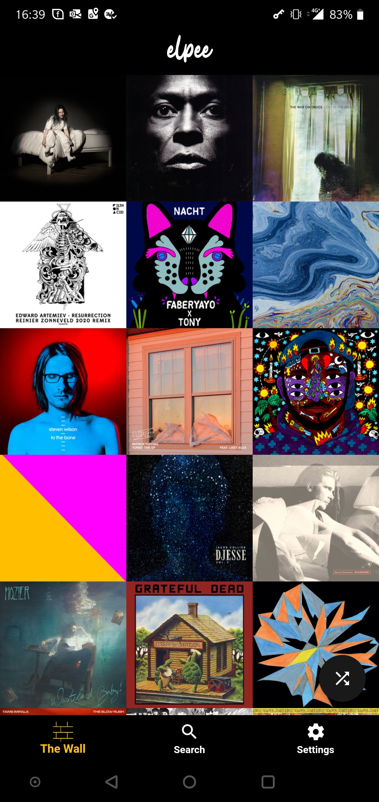
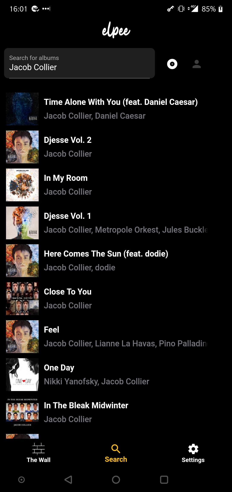
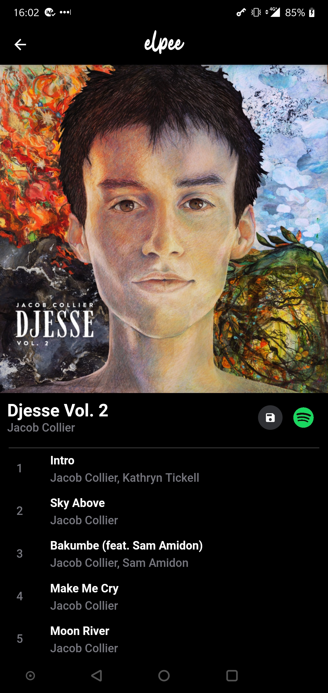
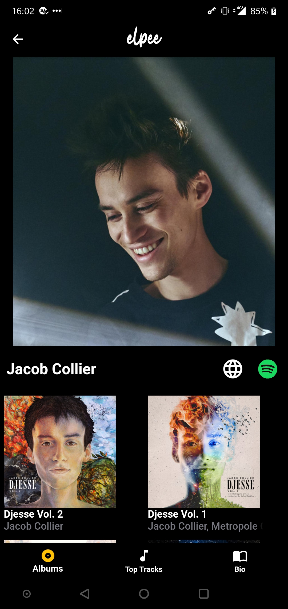

# elpee - Explore and share music

## About

Elpee is a multiplatform app written entirely in [Dart/Flutter](https://flutter.dev/). The data is retrieved from the [Spotify Web API](https://developer.spotify.com/documentation/web-api/) and the [Wikimedia API](https://www.mediawiki.org/wiki/API:Main_page). I used [Firebase](https://firebase.google.com/) to persist albums on <i>'The Wall'</i>. For state management, I went with the BLoC pattern.

    
    

## Why

I wanted to practice with Flutter. I decided to use it for my (future) portfolio and made it open source.

The app serves as a music reference app. It has hotlinks to Spotify and Wikipedia. Every user can save albums to 'The Wall': an ever growing pool of albums. I put the emphasis on albums, because I like listening to albums front to back, rather than listening to random songs from a playlist. A lof of the context that contributes to the power of music is missed when listening to seperate songs.

## What does 'elpee' mean

Elpee is Dutch phonetic slang of the abbreviation of an LP record. Like LPs, the main page of Elpee only consists of the album covers. Unlike the famous saying, I <i>do</i> like to judge albums by their cover.

## How long did it take to develop?

I started in July 2019 with no mobile application experience. I did have about 4 months of experience in JavaScript and React/Redux. The app was launched in March 2020.

